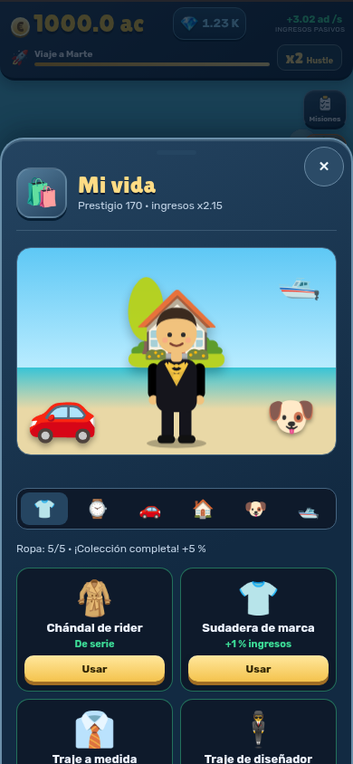
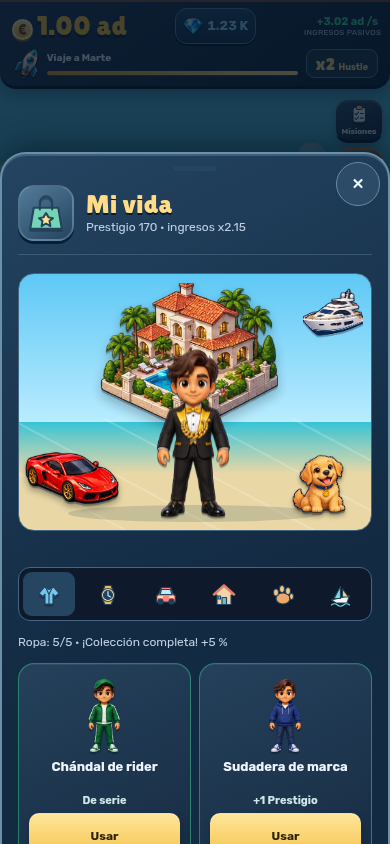
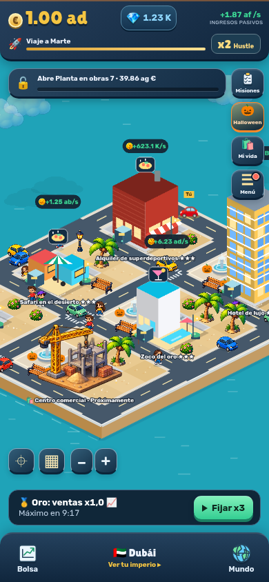
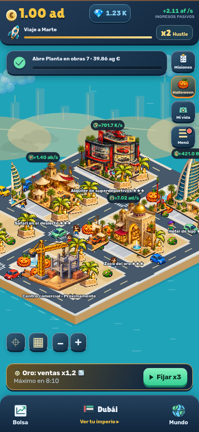
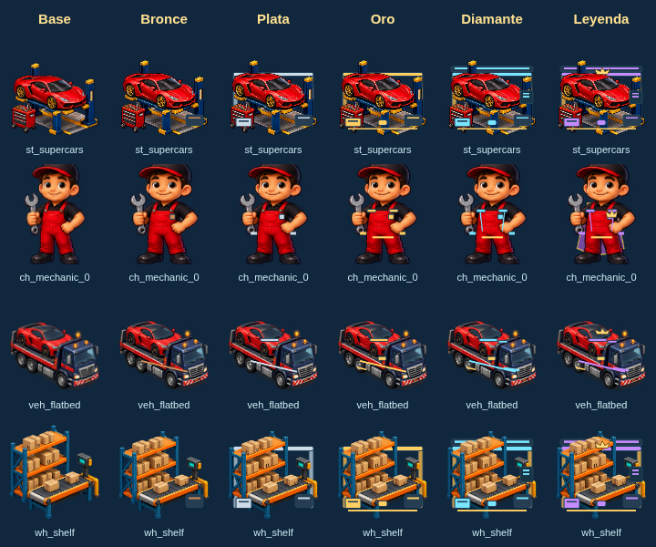
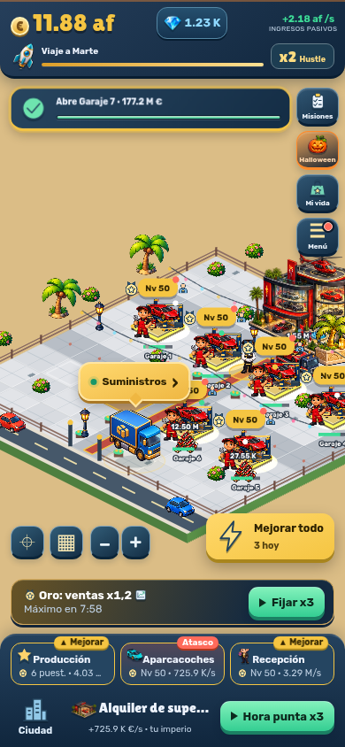
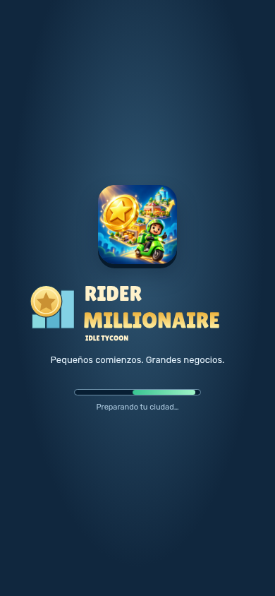

# Revisión visual

Antes: commit `8b0f8a2` de `claude/festive-allen-vb7bc1`. Después: esta rama.
Las comparaciones usan la misma partida local preparada, español, 390×844 y fecha de Halloween. No representan una cuenta real. Supabase se simula y no recibe escrituras.

| Escena | Antes | Después |
| --- | --- | --- |
| Mi vida |  |  |
| Dubái |  |  |

 

`report.json` recoge 110 comprobaciones de Chromium: paneles, 14 negocios, tres ciudades, dos idiomas, 320/390/560 px, visitantes, compras/equipamiento, límites de texturas por rango y movimiento reducido. No certifica rendimiento físico ni integración del servidor. Una prueba adicional comprueba que el fantasma concede los caramelos mediante su modal existente.

Las capturas de tienda 1080×1920 y el gráfico 1024×500 están en `public/brand/store/`. Receta: `VISUAL_OUTPUT=artifacts/store npm run capture:visuals -- --store`, seguida de `npm run brand:store`. Para repetir el contacto de rangos: Vite en 5173 y `node scripts/capture-ranks.mjs`.
