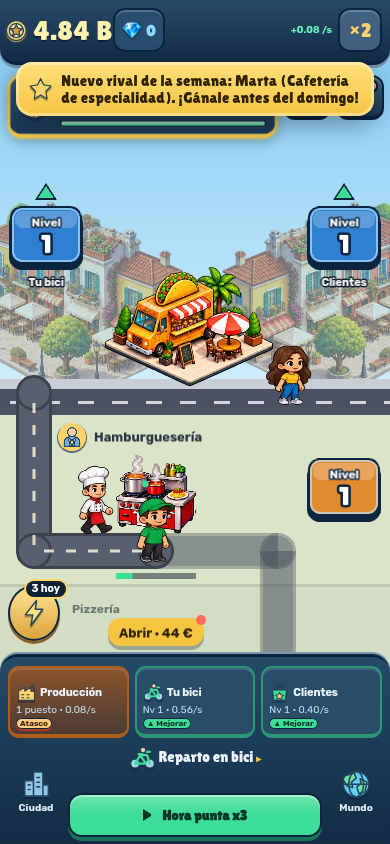
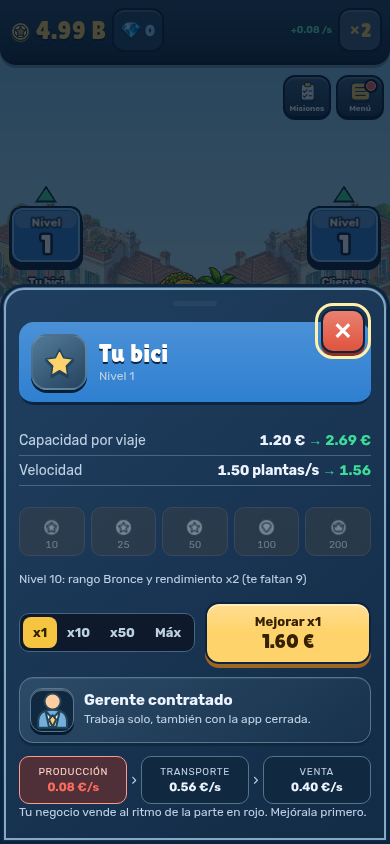
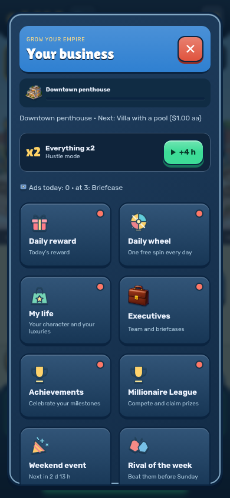
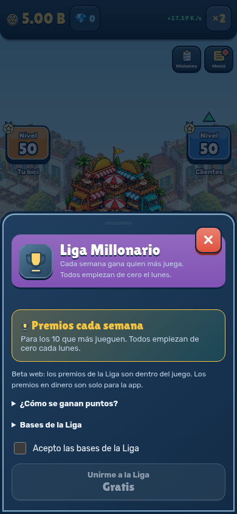

# Fase 1: kit de interfaz y Nivel

229 tests y build correctos. [Informe](report.json): 60 comprobaciones a390×844, ES/EN y movimiento completo/reducido, una/ocho paradas, toque de Nivel que abre sin cambiar la partida, menú y siete paneles.

Receta: `node scripts/capture-visual-phases.mjs`. Partidas locales de demostración, servidor simulado, sin escrituras remotas. Estos resultados no miden Android físico. La ilustración provisional de bici de estas capturas es el punto de partida de la fase2.
