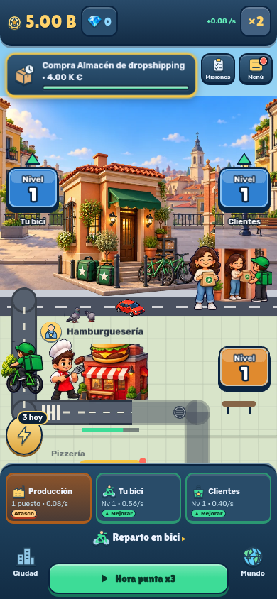
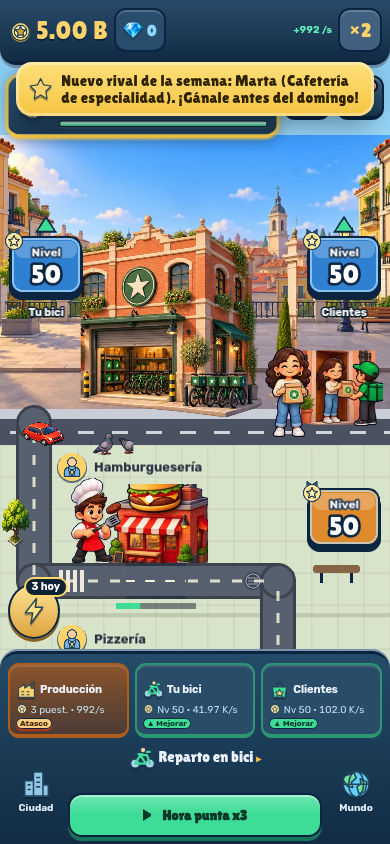
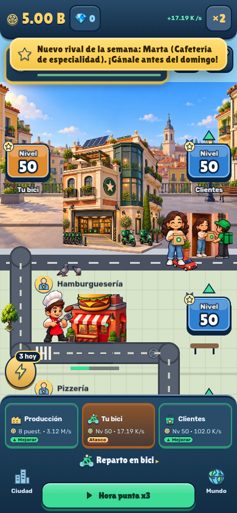
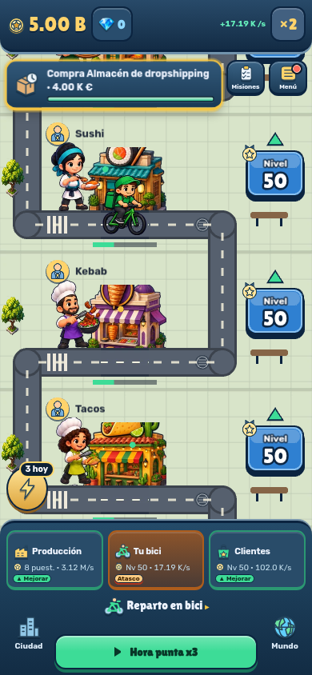
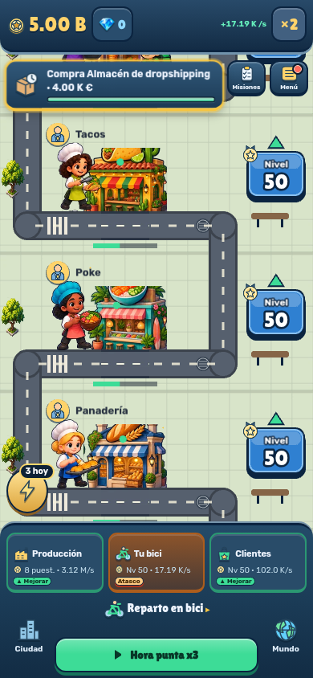
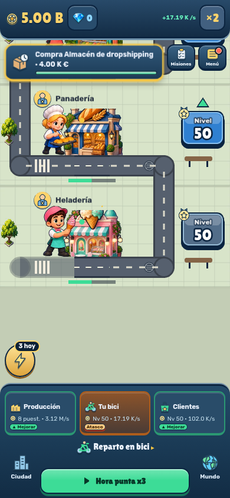
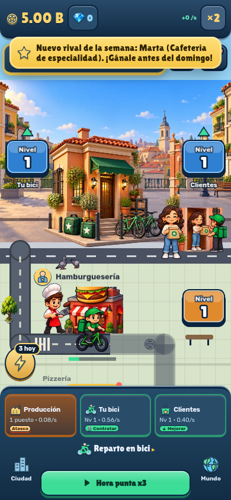
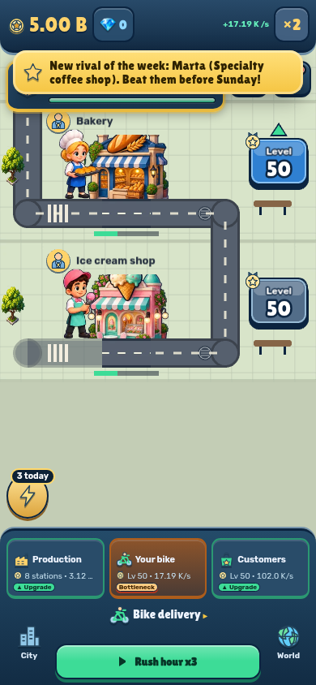

# Fase 2: reparto en bici

Pantalla completa del barrio madrileño: tres sedes, ocho fachadas y cocineros distintos, protagonista sobre bicicleta, clientes y bolsas. 61 piezas propias PNG/WebP; las copias WebP nuevas suman 1,01 MB. Orígenes, cajas de extracción y recetas en [ART](../../ART.md).

Validación: 229 tests y compilación de producción correctos; 11 comprobaciones finales de arte/WebP/idiomas correctas tras el último ajuste de sprites. [Informe](report.json): 76 controles a 390×844 en ES/EN y movimiento completo/reducido, una/ocho paradas, tres sedes, Nivel que abre el panel sin cambiar el nivel, arte cargado, mantener pulsado y soltar fuera, menú y siete paneles. Las capturas corresponden a partidas locales de demostración; Supabase está simulado y no se envían partidas ni resultados.

Receta: `node scripts/capture-visual-phases.mjs`. Las escenas calculan solo geometría y animación; nombres, precios, rangos, estado de trabajo y cantidades provienen del modelo de vista. El pedaleo usa el Bridge y la acción existente. Se preservan recompensas, visitantes, tutorial, mecánica física y desplazamiento.

La medición de 60 fps en un móvil físico queda pendiente. Chromium aquí usa renderizado por software; estas capturas verifican presentación e interacción, no certifican el rendimiento del dispositivo.

[Descripción preparada para la PR](PR.md). Base: `codex/visual-phase-1-interface`; rama: `codex/visual-phase-2-bike`.
