# Entrega visual agrupada: fases 3–9

Las fases restantes de VISUAL se agrupan por petición del usuario y se incorporan a la [PR #17](https://github.com/carlosconesa14-design/foco-landing/pull/17), que ya contenía la referencia de bici y el kit de interfaz. Rama de trabajo y respaldo: `codex/visual-phases-3-9`. Se puede revisar la entrega completa desde una sola PR.

Se completan los 14 mundos restantes de Madrid, Miami y Dubái y la feria: ocho puestos distintos por negocio, tres sedes, trabajadores con tres poses, materiales de ruta, ambientes y transportes con vistas traseras. Incluye paneles ilustrados, navegación de mejoras, árbol de Escuela, mapa mundial, oficina con placas de mejoras reales, viajes, campana de bolsa, trofeos, habilidades, recompensas y decoración de temporada.

## Mundos y paradas

Las capturas usan partidas locales preparadas, a 390×844. El dinero y los niveles de los ejemplos sirven para revisar la presentación; no representan cuentas reales.

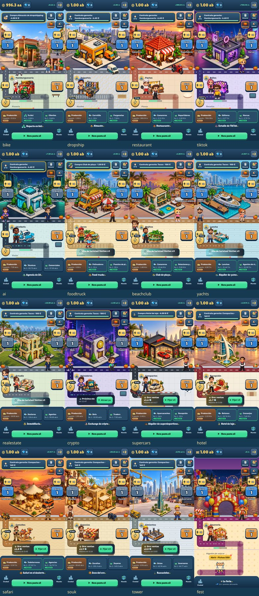
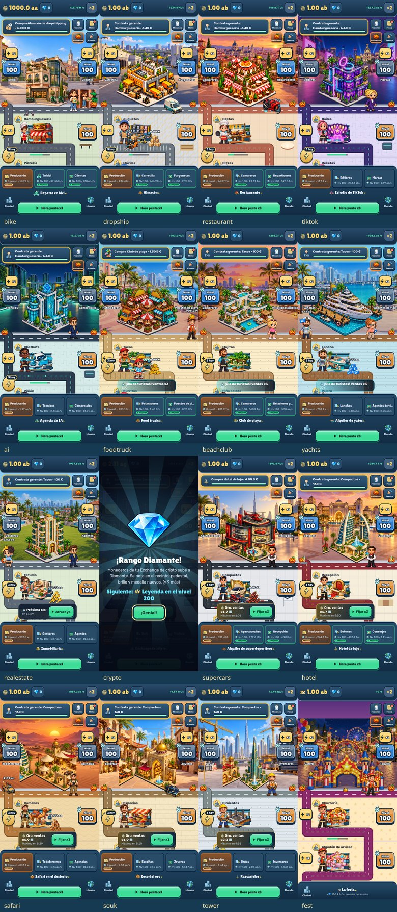
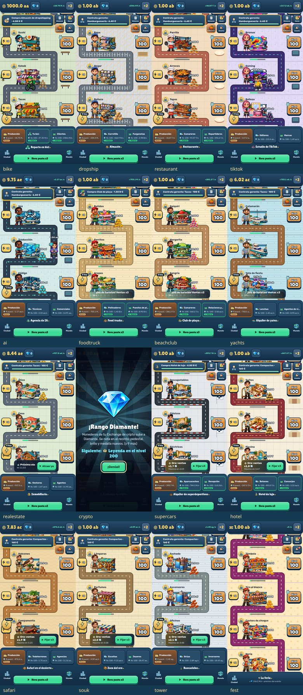
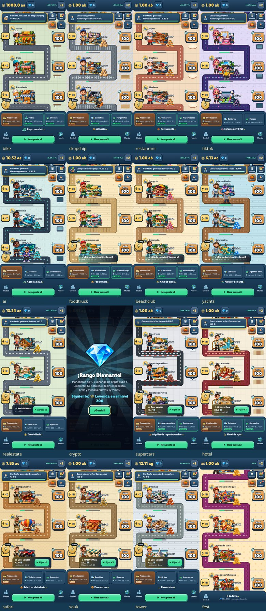
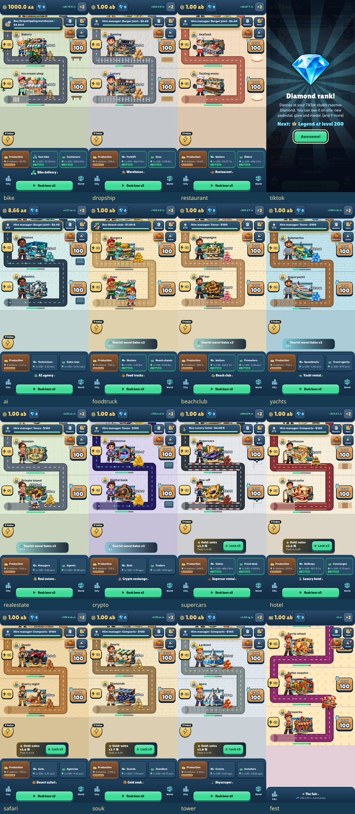

## Ciudad y paneles

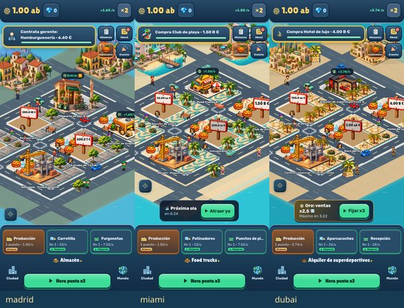
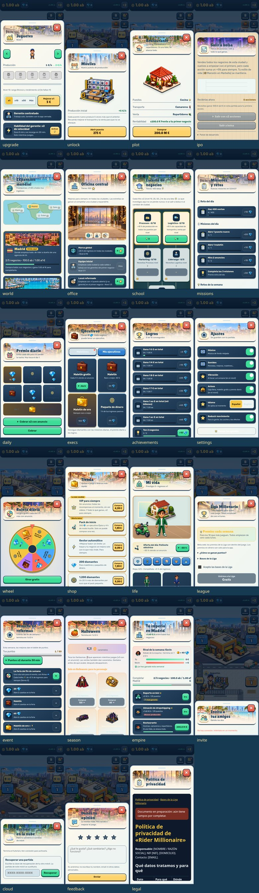

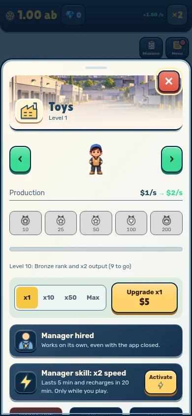
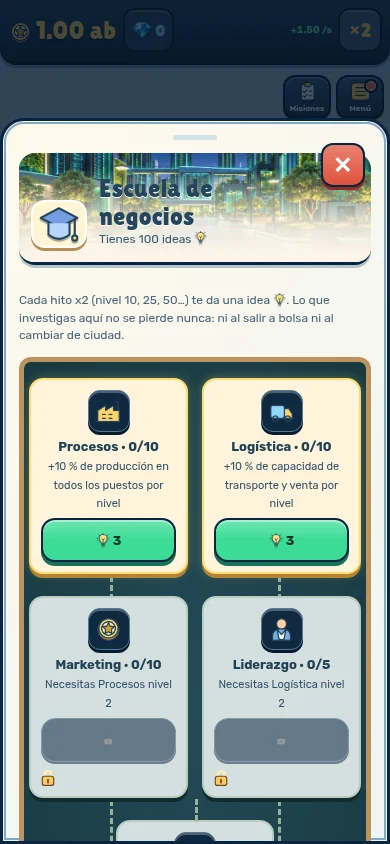
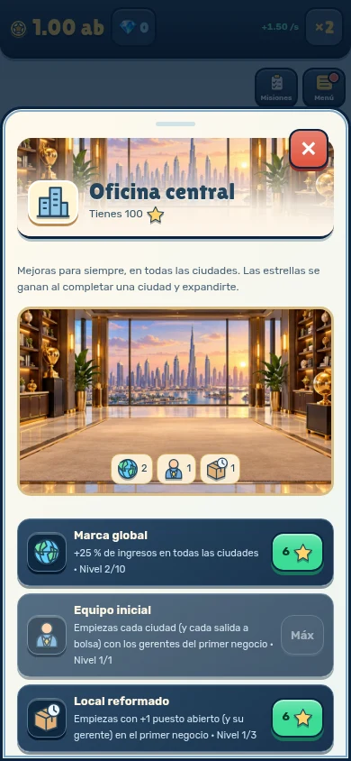
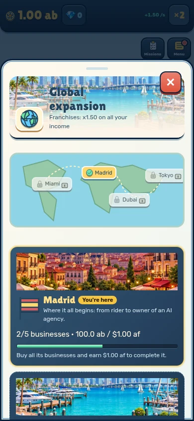
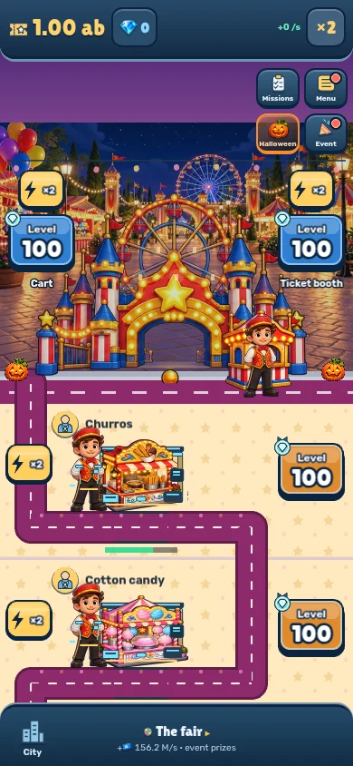

## Validación

- **243 tests**, en 31 archivos, correctos; `npm run build` correcto.
- **556 comprobaciones móviles** y **328 capturas**, sin errores de consola: español/inglés × movimiento completo/reducido; los 16 negocios con 1 y 8 paradas, últimas paradas, 23 paneles y las tres ciudades.
- Puestos propios cargados, sedes correctas, ningún sprite ausente, caché de mundos limitada a dos, botones Nivel ≥70×56 y controles de los paneles ≥44 px. Navegación entre partes y acción real de estudio comprobadas.
- Las peticiones de Supabase se interceptan con respuestas locales: no se envían cuentas, puntuaciones ni partidas modificadas.
- PNG y WebP disponibles; originales y recortes versionados. Recetas y prompts en [ART](../../ART.md).
- **Pendiente: medir 60 fps en un móvil físico de gama media.** Chromium utiliza renderizado por software; esta revisión no certifica rendimiento nativo. Tampoco valida compras/anuncios/servidor reales.

El detalle de cada comprobación está en [report.json](report.json). Repetir: `node scripts/capture-visual-overhaul.mjs`, seguido de `node scripts/build-visual-overhaul-gallery.mjs`. Los originales de captura se guardan localmente en `artifacts/visual-phases-3-9/`.
